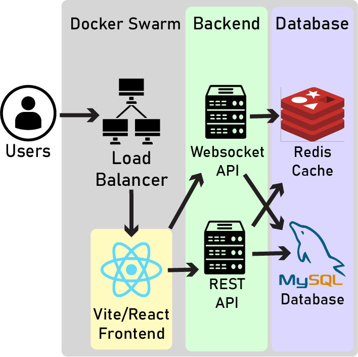

# Open-Response Client
Welcome to the Open-Response React.js Frontend Client! This README.md is dedicated to development guidance and information reguarding the client side of the application. For more information about contributing, or general user guides, please visit the [Open-Response Wiki](https://github.com/OSU-MC/Open-Response/wiki).

## Setup Application for Client Development
This guide is specifically for local development of the Open-Response Client. Please refer to the repository [README.md](../README.md) for installation and development environment setup instructions.

## Running the Frontend Client
First, before running the Open-Response Client, ensure that the Open-Response Core is running. The Open-Response Core provides the backend services that the client will interact with. Additionally, please ensure that the Open-Response WebSocket server is running, as the client relies on it for real-time updates. Lastly, ensure that the MySQL database is running and accessible, so that the client can interact with it through the Open-Response Core.

To start the Open-Response Core REST API, navigate to the `core` directory and run the following command:
```bash
cd ../core
```
Then, ensure that the Open-Response Core REST API is running by executing:
```bash
npm run start
```

Next, navigate back to the `client` directory:
```bash
cd ../client
```

Then start the Open-Response Client development server. This will allow you to view the client in your web browser and see changes in real-time as you develop:
```bash
npm run start
```

To stop the Open-Response Core REST API, you simply need to stop the process running in the terminal where you executed `npm run start`. You can do this by pressing `Ctrl + C`.


If you want to test the production build of the Open-Response Client, you can run the following command:
```bash
npm run deploy
```
The production build will automatically served by Vite's built-in server.

## Update Client Configuration
Modify `/client/.env` to update the Open-Response Client configuration. The `VITE_API_URL` environment variable should be set to the Open-Response Core URL. For basic testing, the default values can be used.

## Tech Stack
The Open-Response Client is written in JavaScript and built using the following technologies:
- React.js, bundled with Vite
- CSS for styling
- Redux for state management
- Axios for API calls
- React Router for navigation
- Socket.IO for real-time communication with the WebSocket server

As you can see in the system architecture diagram below, the Open-Response Client interacts with the Open-Response Core via API calls and uses WebSockets for real-time updates. The client is designed to be modular, allowing for easy development and maintenance of independent components.


## Organization
```bash
Open-Response/
├── client/                     # Frontend client code
├── ├── public/                 # Public assets
├── ├── src/                    # Source code
├── ├── ├── __tests__/          # Test files (not unit or integration tests)
├── ├── ├── components/         # React components
├── ├── ├── hooks/              # Custom React hooks
├── ├── ├── pages/              # Page components
├── ├── ├── redux/              # Redux store and actions
├── ├── ├── styles/             # CSS styles
├── ├── ├── utils/              # Utility functions, API utilities, and constants
```

## Interacting with the Database

```plaintext
Database ← apiUtil ← Hooks ──→ Redux
                         └──→ Pages
```

### apiUtil (API Utility Layer)
Handles low-level API interaction logic.

- **Input:**  
  - API method (`GET`, `POST`, `PUT`, `DELETE`)  
  - Endpoint/route  
  - `reactOpts` (optional fetch options)  
  - Request body (for `POST`/`PUT`)  
  - URL params (e.g., `:id`)

- **Output:**  
  - Raw CRUD response (success or error)

### Hooks (Data Coordination Layer)
Bridges `apiUtil` and the application state/UI.

- **Input:**  
  - URL params or context

- **Output:**  
  - Formatted API responses  
  - Loading and error states  
  - User messages  
  - State updates via Redux dispatch
