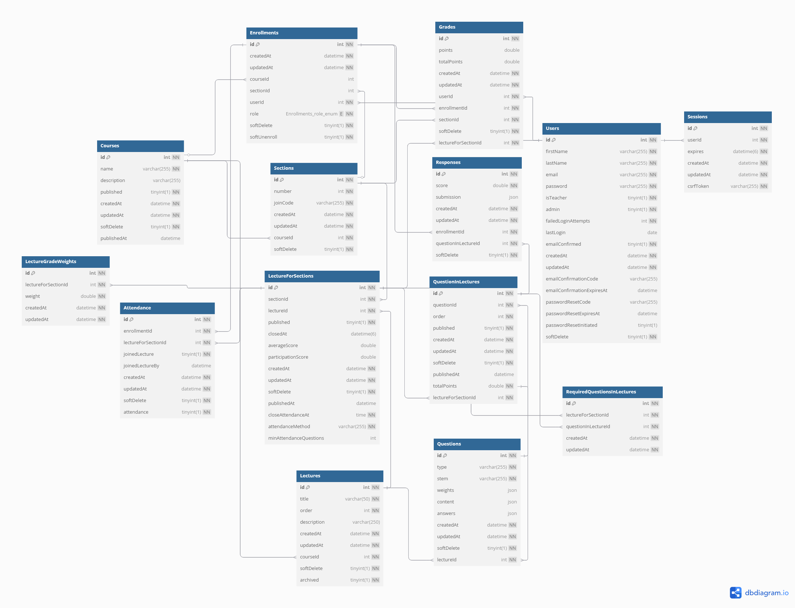

# Open-Response Core
Welcome to the Open-Response node.js Backend Core! This README.md is dedicated to development guidance and information reguarding the core side of the application. For more information about contributing, or general user guides, please visit the [Open-Response Wiki](https://github.com/OSU-MC/Open-Response/wiki).

## Setup Application for Development
Before starting developmentk, follow all setup and initialization steps present in [README.md](../README.md).

There are two development methods for the Open-Response Core application.

1. **MySQL**: Install MySQL locally and manually intilize databases for detailed application control. This method is recommended for development use, as it allows for automatic restarts on file changes and provides a more controlled environment. It requires your MySQL server to be running, and you will need to manually start the application using `npm run start` in the `/core/` directory. This method is also recommended for testing the application locally, as it allows for more control over the database state and migrations.
2. [**Docker**](#docker): Install Docker locally and automatically deploy the databases for a simple development environment through `npm run start` in the root directory. This method is not recommended for development use, as it requires manually stopping the application as docker does not support automatic restarts on file changes. We do still recommend testing the application using this method, as it is the primary deployment method.

### Docker
The core NodeJS app and MySQL database can also be deployed in containers using Docker (As used in the primary installation method). The Dockerfile will build the core NodeJS app as a standalone, but if you wish to run the entire application, you can use the `npm run start` command from the root directory. This will start the Open-Response Core REST API development server, along with the MySQL database, frontend server, and websocket server in docker containers that are orchestrated with Docker Swarm.

If you plan to re-initialize the database from scratch remember to delete the docker volume for it as well.

#### Start Development Server
Start the Open-Response Core REST API development server with the command:
```bash
npm run start
```

#### (Optional) Test the Application
Testing the application is easy. The Jest testing framework is used to write tests for the system. A script has been added to the package.json file to run tests locally:
```
npm run test
```

If you run into issues, ensure you have done the following:
1. Created a local test database
2. Properly instantiated all environment variables for the test environment

#### (Optional) Resetting/Rolling Back Databases
(Append `npx` commands with `--env test` to run on the test database)

Undo Database Migrations
```bash
npx sequelize-cli db:migrate:undo:all
```

Undo Test Database Seeding
```bash
npx sequelize-cli db:seed:undo:all
```

Reset Local Database
```bash
mysql -u root -p -e "
  DROP DATABASE IF EXISTS openresponse_development;
  DROP DATABASE IF EXISTS openresponse_test;
  CREATE DATABASE openresponse_development;
  CREATE DATABASE openresponse_test;
```

You can also copy and paste this script to force the database to drop all changes to the database and reinitialize it with the latest migrations and seeds:
```bash
mysql -u root -p -e "
  DROP DATABASE IF EXISTS openresponse_development;
  DROP DATABASE IF EXISTS openresponse_test;
  CREATE DATABASE openresponse_development;
  CREATE DATABASE openresponse_test;
"
npx sequelize db:migrate --env development
npx sequelize db:migrate --env test
npx sequelize db:seed:all --env development
npx sequelize db:seed:all --env test
```

## Update Core Configuration
Modify `/core/.env` to update the Open-Response Core configuration. The `DEV_DB_...` and `TEST_DB_...` environment variables should match those in the database/user creation commands listed in the [MySQL](#mysql) setup steps below. Additionally, `CLIENT_URL` should be set to the Open-Response Client application URL. For basic testing, the default values can be used.

## Application Authentication & Session
The application uses cookie-based authentication once a user session has been created (i.e. a user has logged in). A user's session will have a specific XSRF token value associated with it to protect against XSRF attacks. As such, the value of that token will be sent back as a cookie, and the application expects to recieve with each authenticated request a custom X-XSRF-TOKEN header with that value, along with the traditional authentication cookie \_openresponse_session which the application generated as part of initial session creation.

A user's session is valid for a minimum of 4 hours, and as long as the user is active within 4 hours of last activity, the session can be valid for as long as 24 hours. In other words, users will be asked to login again after 4 hours of inactivity or 24 hours since they last provided their credentials.

## Configuring Services
### Emailer
The application is configured to use Courier notification infastructure to message users. In order to use the application's mailer, create an account at https://www.courier.com/. Follow Courier's setup instructions and prompts.

The process should yield a bearer token in the HTTPS request Courier generates. Copy this token, and paste it in the application environment as `COURIER_AUTH_TOKEN`. Also set `EABLE_EMAIL='true'`. That's it! You should be able to interact with the configured emailer through Courier.

It's worth noting that the application is only configured for email use through Courier, but Courier supports a variety of modern notification methods.

# Database
The Open-Response Core uses a MySQL database to store all application data. The database schema is defined using Sequelize migrations, which allows for version control of the database structure.

## Database Schema
The database schema is defined in the `core/database/migrations` directory. Each migration file contains a set of instructions to create or modify database tables and relationships. The schema includes tables for users, courses, questions, responses, and more. The image below provides a visual representation of the database schema:


## Data Dictionary

This section describes the structure of the key database tables used in the MySQL database. It includes field definitions, types, constraints, and foreign key relationships.

### Table Schemas

#### Users

| Column                  | Type         | Description                          | Constraints              |
|-------------------------|--------------|--------------------------------------|--------------------------|
| id                      | INT          | Unique user ID                       | PK, Auto-increment       |
| firstName               | VARCHAR(255) | User's first name                    | Required                 |
| lastName                | VARCHAR(255) | User's last name                     | Required                 |
| email                   | VARCHAR(255) | User email                           | Required, Unique         |
| password                | VARCHAR(255) | Hashed user password                 | Required                 |
| isTeacher               | BOOLEAN      | Whether the user is a teacher        | Required, Default: false |
| admin                   | BOOLEAN      | Admin privileges                     | Default: false           |
| emailConfirmed          | BOOLEAN      | Email confirmation status            | Default: false           |
| createdAt / updatedAt   | DATETIME     | Timestamps for record lifecycle      | Required                 |


#### Courses

| Column        | Type         | Description                       | Constraints              |
|---------------|--------------|-----------------------------------|--------------------------|
| id            | INT          | Unique course ID                  | PK, Auto-increment       |
| name          | VARCHAR(255) | Course name                       | Required                 |
| description   | VARCHAR(255) | Course description                | Optional                 |
| published     | BOOLEAN      | Published status                  | Default: false           |
| publishedAt   | DATETIME     | When the course was published     | Optional                 |
| softDelete    | BOOLEAN      | Soft deletion flag                | Default: false           |
| createdAt / updatedAt | DATETIME | Record timestamps            | Required                 |


#### Enrollments

| Column       | Type                    | Description                               | Constraints                                |
|--------------|-------------------------|-------------------------------------------|--------------------------------------------|
| id           | INT                     | Enrollment record ID                      | PK, Auto-increment                         |
| userId       | INT                     | Linked user                               | FK → Users(id), Required                   |
| courseId     | INT                     | Linked course (for teachers)              | FK → Courses(id), Optional                 |
| sectionId    | INT                     | Linked section (for students/TAs)         | FK → Sections(id), Optional                |
| role         | ENUM(student, teacher, ta) | Role in course                         | Required                                   |
| softDelete   | BOOLEAN                 | Soft deletion flag                        | Default: false                              |
| softUnenroll | BOOLEAN                 | Flag for voluntary unenrollment           | Default: false                              |
| createdAt / updatedAt | DATETIME      | Record timestamps                         | Required                                   |


#### Lectures

| Column       | Type         | Description                          | Constraints                  |
|--------------|--------------|--------------------------------------|------------------------------|
| id           | INT          | Unique lecture ID                    | PK, Auto-increment           |
| title        | VARCHAR(50)  | Lecture title                        | Required                     |
| order        | INT          | Order in course                      | Required                     |
| description  | VARCHAR(250) | Optional lecture description         | Optional                     |
| courseId     | INT          | Associated course                    | FK → Courses(id), Required   |
| archived     | BOOLEAN      | Whether the lecture is archived      | Default: false               |
| isLive       | BOOLEAN      | Whether the lecture is currently live| Default: false               |
| createdAt / updatedAt | DATETIME | Timestamps for record         | Required                     |


#### LectureForSections

| Column             | Type       | Description                                 | Constraints                          |
|--------------------|------------|---------------------------------------------|--------------------------------------|
| id                 | INT        | ID                                          | PK, Auto-increment                   |
| sectionId          | INT        | Linked section                              | FK → Sections(id), Required          |
| lectureId          | INT        | Linked lecture                              | FK → Lectures(id), Required          |
| published          | BOOLEAN    | Whether lecture is published to section     | Default: false                       |
| isLive             | BOOLEAN    | If live session is ongoing                  | Default: false                       |
| attendanceMethod   | ENUM       | join / joinBy / requiredQuestions           | Required, Default: join              |
| minAttendanceQuestions | INT    | # of required questions for attendance      | Default: 0                           |
| createdAt / updatedAt | DATETIME | Record timestamps                        | Required                             |


#### Attendance

| Column             | Type       | Description                                | Constraints                            |
|--------------------|------------|--------------------------------------------|----------------------------------------|
| id                 | INT        | Attendance record ID                       | PK, Auto-increment                     |
| enrollmentId       | INT        | Linked enrollment                          | FK → Enrollments(id), Required         |
| lectureForSectionId| INT        | Linked lecture for section                 | FK → LectureForSections(id), Required  |
| joinedLecture      | BOOLEAN    | Whether the student joined                 | Default: false                         |
| joinedLectureBy    | DATETIME   | Timestamp of join                          | Optional                               |
| attendance         | BOOLEAN    | Calculated attendance flag                 | Default: false                         |
| softDelete         | BOOLEAN    | Soft deletion flag                         | Default: false                         |
| createdAt / updatedAt | DATETIME | Record timestamps                        | Required                               |


#### Grades

| Column             | Type     | Description                                      | Constraints                          |
|--------------------|----------|--------------------------------------------------|--------------------------------------|
| id                 | INT      | Unique grade ID                                  | PK, Auto-increment                   |
| enrollmentId       | INT      | Linked enrollment                                | FK → Enrollments(id), Required       |
| lectureForSectionId| INT      | Linked lecture-for-section                       | FK → LectureForSections(id), Required|
| points             | DOUBLE   | Points earned by student                         | Optional, ≥ 0                        |
| totalPoints        | DOUBLE   | Total points possible                            | Optional, ≥ 0                        |
| softDelete         | BOOLEAN  | Soft deletion flag                               | Default: false                       |
| createdAt / updatedAt | DATETIME | Record timestamps                          | Required                             |


#### LectureGradeWeights

| Column             | Type     | Description                                  | Constraints                          |
|--------------------|----------|----------------------------------------------|--------------------------------------|
| id                 | INT      | Grade weight record                          | PK, Auto-increment                   |
| lectureForSectionId| INT      | Lecture-for-section linked                   | FK → LectureForSections(id), Required|
| weight             | DOUBLE   | Weight assigned to this lecture              | Required, ≥ 0                        |
| createdAt / updatedAt | DATETIME | Record timestamps                       | Required                             |


#### Questions

| Column       | Type       | Description                                                  | Constraints                          |
|--------------|------------|--------------------------------------------------------------|--------------------------------------|
| id           | INT        | Question ID                                                  | PK, Auto-increment                   |
| lectureId    | INT        | Associated lecture                                           | FK → Lectures(id), Required          |
| type         | VARCHAR    | Question type (e.g., multiple choice, multiple answer)       | Required, Enum constraint            |
| stem         | VARCHAR    | Text of the question prompt                                 | Required                             |
| weights      | JSON       | Per-option grading weights                                   | Validated per question type          |
| content      | JSON       | Question content (e.g., options)                             | Required, per-type validated         |
| answers      | JSON       | Correct answer mapping                                       | Required, per-type validated         |
| totalPoints  | DOUBLE     | Total score possible                                         | Default: 1, ≥ 0                      |
| order        | INT        | Sort order within lecture                                   | Default: -1                          |
| isLive       | BOOLEAN    | Whether question is active in live lecture                   | Default: false                       |
| softDelete   | BOOLEAN    | Soft deletion flag                                           | Default: false                       |
| createdAt / updatedAt | DATETIME | Record timestamps                                | Required                             |


#### QuestionInLectures

| Column              | Type     | Description                                        | Constraints                               |
|---------------------|----------|----------------------------------------------------|-------------------------------------------|
| id                  | INT      | ID                                                | PK, Auto-increment                        |
| questionId          | INT      | Linked question                                   | FK → Questions(id), Required              |
| lectureForSectionId | INT      | Linked lecture-for-section                        | FK → LectureForSections(id), Required     |
| published           | BOOLEAN  | Whether the question is visible in lecture        | Default: false                            |
| publishedAt         | DATETIME | Time the question was published                   | Optional                                  |
| softDelete          | BOOLEAN  | Soft deletion flag                                | Default: false                            |
| createdAt / updatedAt | DATETIME | Record timestamps                              | Required                                  |


#### RequiredQuestionsInLectures

| Column     | Type | Description                              | Constraints                           |
|------------|------|------------------------------------------|---------------------------------------|
| id         | INT  | ID                                        | PK, Auto-increment                    |
| lectureId  | INT  | Associated lecture                        | FK → Lectures(id), Required           |
| questionId | INT  | Required question                         | FK → Questions(id), Required          |
| createdAt / updatedAt | DATETIME | Record timestamps          | Required                              |


#### Responses

| Column              | Type     | Description                                       | Constraints                               |
|---------------------|----------|---------------------------------------------------|-------------------------------------------|
| id                  | INT      | Unique response ID                                | PK, Auto-increment                        |
| enrollmentId        | INT      | Student enrollment ID                             | FK → Enrollments(id), Required            |
| questionInLectureId | INT      | The question instance answered                    | FK → QuestionInLectures(id), Required     |
| score               | DOUBLE   | Normalized score (0–1)                            | Required, 0 ≤ score ≤ 1                   |
| submission          | JSON     | JSON-encoded submitted answers                    | Optional                                  |
| softDelete          | BOOLEAN  | Soft deletion flag                                | Default: false                            |
| createdAt / updatedAt | DATETIME | Record timestamps                             | Required                                  |


#### Sections

| Column     | Type         | Description                                | Constraints                          |
|------------|--------------|--------------------------------------------|--------------------------------------|
| id         | INT          | Unique section ID                          | PK, Auto-increment                   |
| courseId   | INT          | Associated course                          | FK → Courses(id), Required           |
| number     | INT          | Section number within course               | Required                             |
| joinCode   | VARCHAR(255) | Unique code to join this section           | Required, Unique (6 alphanumeric)    |
| softDelete | BOOLEAN      | Soft deletion flag                         | Default: false                       |
| createdAt / updatedAt | DATETIME | Record timestamps                | Required                             |


#### Sessions

| Column     | Type         | Description                            | Constraints                          |
|------------|--------------|----------------------------------------|--------------------------------------|
| id         | INT          | Session ID                             | PK, Auto-increment                   |
| userId     | INT          | Associated user                        | FK → Users(id), Required             |
| expires    | DATETIME(6)  | Expiration time                        | Required                             |
| csrfToken  | VARCHAR(255) | CSRF protection token                  | Unique, Required                     |
| createdAt / updatedAt | DATETIME | Record timestamps            | Required                             |


#### SequelizeMeta

| Column | Type         | Description                              | Constraints               |
|--------|--------------|------------------------------------------|---------------------------|
| name   | VARCHAR(255) | Migration filename executed              | PK, Unique                |


### Foreign Key Relationships

| Table                   | Column               | References                   |
|------------------------|----------------------|------------------------------|
| Attendance | enrollmentId | Enrollments(id) |
| Attendance | lectureForSectionId | LectureForSections(id) |
| Enrollments | userId | Users(id) |
| Enrollments | courseId | Courses(id) |
| Enrollments | sectionId | Sections(id) |
| Grades | enrollmentId | Enrollments(id) |
| Grades | lectureForSectionId | LectureForSections(id) |
| Grades | userId | Users(id) |
| LectureForSections | sectionId | Sections(id) |
| LectureForSections | lectureId | Lectures(id) |
| LectureGradeWeights | lectureForSectionId | LectureForSections(id) |
| Lectures | courseId | Courses(id) |
| QuestionInLectures | lectureForSectionId | LectureForSections(id) |
| QuestionInLectures | questionId | Questions(id) |
| Questions | lectureId | Lectures(id) |
| RequiredQuestionsInLectures | lectureId | Lectures(id) |
| RequiredQuestionsInLectures | questionId | Questions(id) |
| Responses | enrollmentId | Enrollments(id) |
| Responses | questionInLectureId | QuestionInLectures(id) |
| Sections | courseId | Courses(id) |
| Sessions | userId | Users(id) |
